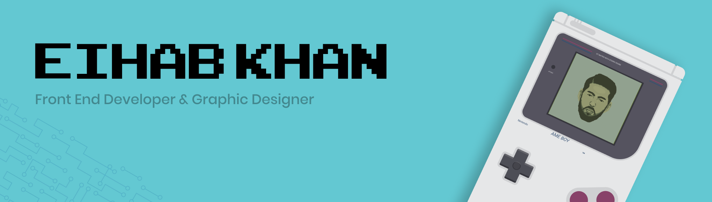

### Hello there, I'm <a href="https://twitter.com/eihab_khan" target="_blank">Eihab Khan</a> 
---

<a href="https://linkedin.com/in/eihab-khan/" target="_blank"></a>
<a href="https://twitter.com/eihab_khan" target="_blank"></a>

### Glad to see you here! &nbsp;

I'm a software developer based in Meknes with 1 year of experience in Web development and 4 years of experience in graphic design.

My focus area for the past year has been front-end development with React. I am very quality-conscious and detail-oriented due to my early career years in Graphic design roles.


**Talking about Personal Stuffs:**

- 🔭 I’m currently working on a cool Design System called Komodo 😉
- 🌱 I’m currently learning NodeJS
- 📫 How to reach me: mastereihab@gmail.com
- ⚡ Fun fact: I am also a <a href="https://www.behance.net/eihabkhan" target="_blank">graphic designer</a>
- 🚀 Check out my <a href="https://github.com/eihabkhan/parrotxt" target="_blank">latest project</a>
- 📝 Resume: [English](https://docs.google.com/document/d/1UUtnyt8pywOsjRsBn-a_N8yoJl672BvqyRlmIdq_UJs/edit?usp=sharing) | [العربية](https://docs.google.com/document/d/1kzuqzYiPfQI6HMjovE_TXle84yQTGxYlV4Ek2yjePi8/edit?usp=sharing)


</br>

**GitHub Skyline:**
Check out my [2020 GitHub Skyline](https://skyline.github.com/eihabkhan/2020)

📈 **My GitHub Stats:**

<!--START_SECTION:waka-->
```text
JavaScript   12 hrs 27 mins  ████████████████▓░░░░░░░░   66.00 % 
TypeScript   2 hrs 57 mins   ████░░░░░░░░░░░░░░░░░░░░░   15.65 % 
HTML         1 hr 35 mins    ██░░░░░░░░░░░░░░░░░░░░░░░   08.42 % 
JSON         51 mins         █░░░░░░░░░░░░░░░░░░░░░░░░   04.56 % 
CSS          28 mins         ▓░░░░░░░░░░░░░░░░░░░░░░░░   02.55 % 
```
<!--END_SECTION:waka-->


