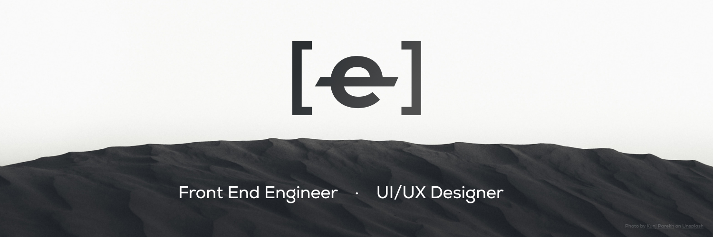

### Hello there, I'm <a href="https://twitter.com/eihab_khan" target="_blank">Eihab Khan</a>
---

<a target="_blank" href="https://linkedin.com/in/eihab-khan/" target="_blank"></a>
<a target="_blank" href="https://twitter.com/eihab_khan" target="_blank"></a>

### Glad to see you here! &nbsp;

I'm a software developer based in Rabat Morocco with 2 year of experience in Web development and 4 years of experience in graphic design.

My focus area for the past two years has been front-end development with React. I am very quality-conscious and detail-oriented due to my early career years in Graphic design roles.
<!--  -->
 

**Talking about Personal Stuffs:**

<!-- - 🔭 I’m currently working on a cool Design System called Komodo 😉 -->
<!-- - 🌱 I’m currently learning X -->
- 📫 How to reach me: eihabkhan1@gmail.com
- ⚡ Fun fact: I am also a <a href="https://www.behance.net/eihabkhan" target="_blank">graphic designer</a>
- 🚀 Check out my <a href="https://github.com/eihabkhan/parrotxt" target="_blank">latest project</a>
- 📝 [Resume](https://docs.google.com/document/d/1UUtnyt8pywOsjRsBn-a_N8yoJl672BvqyRlmIdq_UJs/edit?usp=sharing)

</br>

**GitHub Skyline:**
Check out my [2022 GitHub Skyline](https://skyline.github.com/eihabkhan/2022)
you can also check my [2021 GitHub Skyline](https://skyline.github.com/eihabkhan/2021)

📈 **My GitHub Stats:**

<!--START_SECTION:waka-->

```text
TypeScript   38 hrs 54 mins  ████████████████████████▓   98.34 %
JavaScript   19 mins         ▒░░░░░░░░░░░░░░░░░░░░░░░░   00.81 %
CSS          8 mins          ░░░░░░░░░░░░░░░░░░░░░░░░░   00.37 %
JSON         6 mins          ░░░░░░░░░░░░░░░░░░░░░░░░░   00.26 %
XML          3 mins          ░░░░░░░░░░░░░░░░░░░░░░░░░   00.16 %
```

<!--END_SECTION:waka-->


